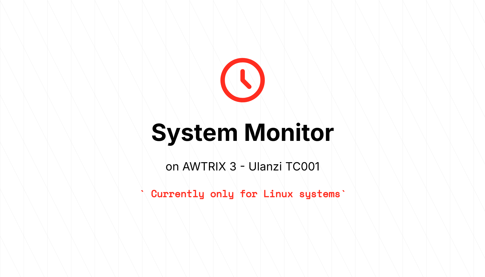

# AWTRIX - System Monitor for Linux

---
AWTRIX System Monitor is a developer-focused tool that periodically sends **system metrics** from a **Linux machine** to a **Pixel Clock** via the **AWTRIX HTTP API**. 
Designed to run as a service, it provides real-time insights into system performance directly on your Pixel Clock.

## Features

- **System Metrics Monitoring:** Collects and transmits CPU usage, memory usage, disk usage, and more.
- **Interval-Based Reporting:** Sends metrics at regular intervals to ensure up-to-date information.
- **Future Enhancements:** Plans to include integrations for Spotify playback information and internet speed tests.
